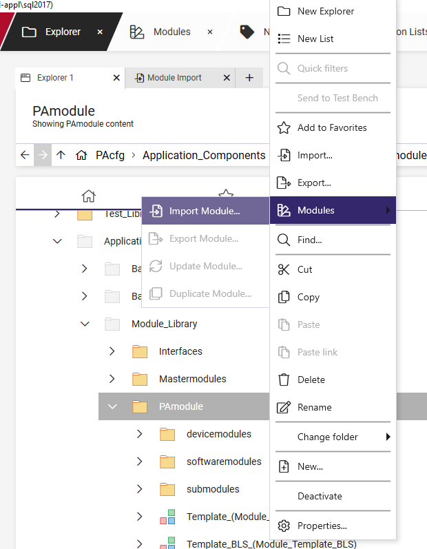
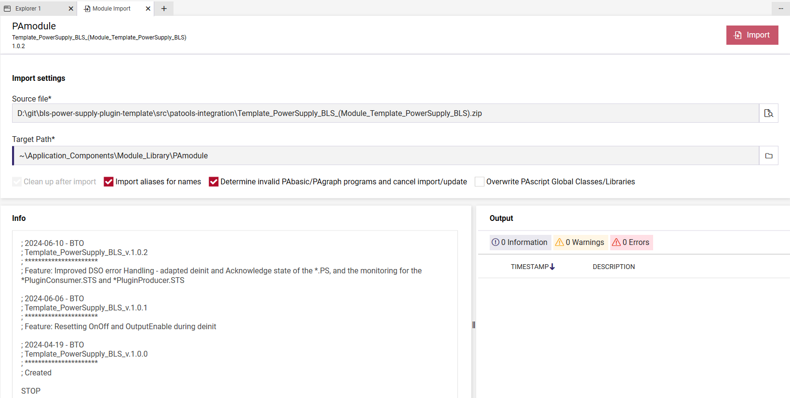
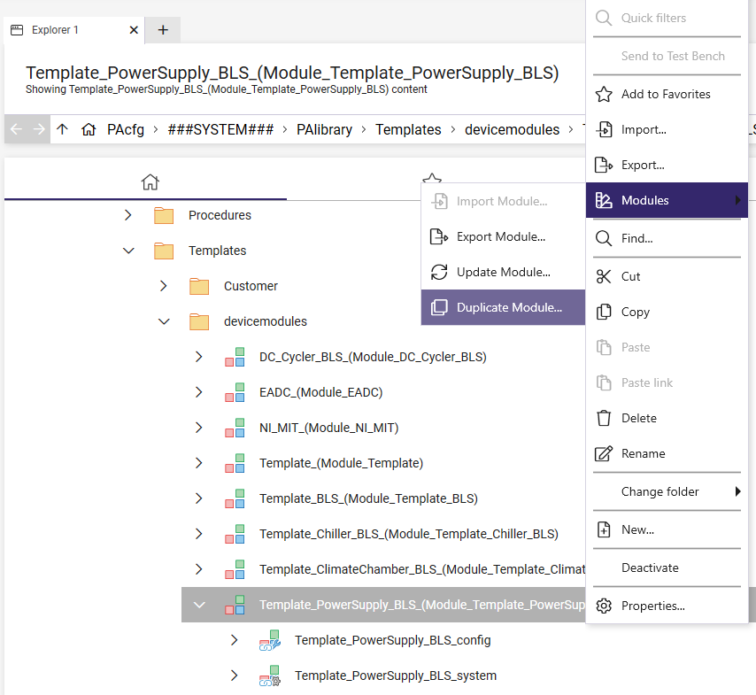
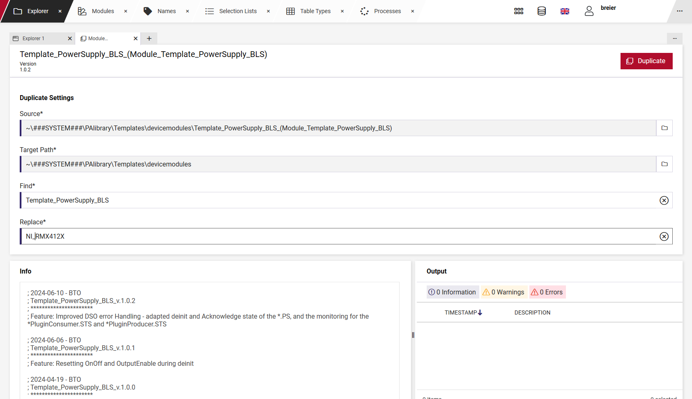
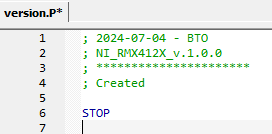
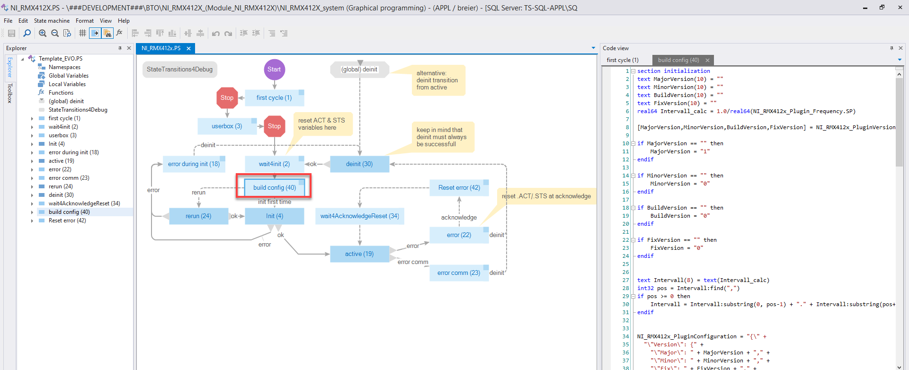
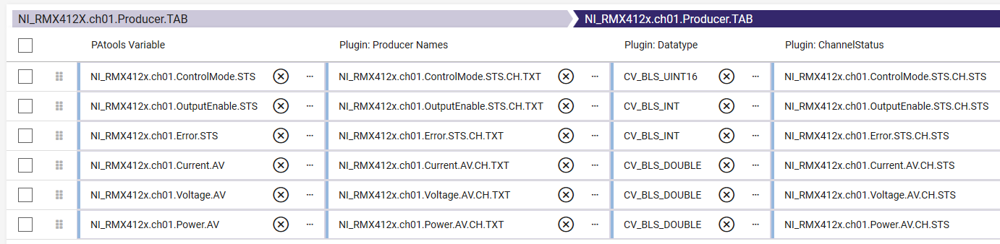
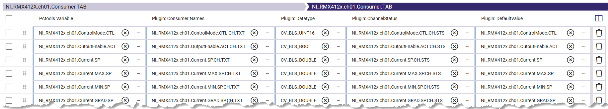
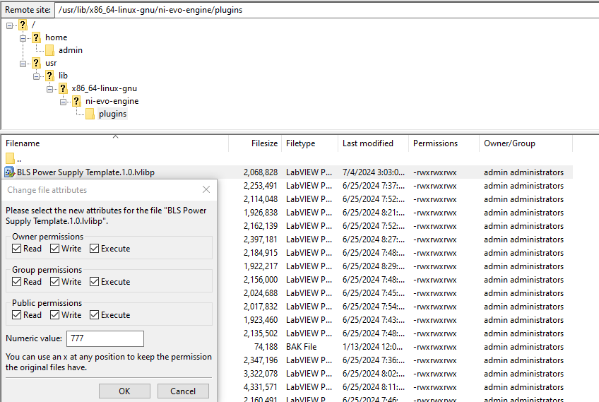

# PAtools Integration

This document describes the process of integrating a new BLS plugin/Driver in PAtools using the Template_PowerSupply_BLS module. This document assumes you have the LabView side of the BLS plugin ready using [capabilities](https://github.com/ni/bls-capabilities) and the PXI target has ADAS installed. 

# Create PAtools driver

1. If you do not already have the Template_PowerSupply_BLS module in your Database import it:

    

    

2. Click on the module with the right mouse button and select "Duplicate folder...".

    

3. The window for duplicating the module opens:

    

    * Target Path: Adapt as you like
    * Find*: enter "Template_PowerSupply_BLS"
    * Replace*: enter your device name / a modul name, e.g. "NI_RMX412X"
    
    Press "Duplicate". When finished the module "NI_RMX412X_(Module_NI_RMX412X)" appears in the path you selected

    Note: In the following the used Normnames/Variables/Group names will all start with "NI_RMX412x" for you they will start with what ever you entered in the Replace* field.

4. Must do Adaptions

    4.1 In the "NI_RMX412X_UB" Variables group (NI_RMX412X_system/userbox)
        * NI_RMX412x_Main.UB.Header: Enter a name you want to display in the Userbox, e.g. "NI_RMX412X

    4.2 In the "NI_RMX412X_Version" Variables group (NI_RMX412X_system/version)
        * NI_RMX412x_Version: 1.0.0 (enter a version you would like to start with, 1.0.0 is an example here)

    4.3 In the PAbasic "NI_RMX412X_Version" adapt the content so you give the information when you created that module, who did create it and which template version you used, e.g. like that:

    

    Note: When you adapt the module later you can increase the version and add also information here. 

    4.4 In the Initialization of Variables group "NI_RMX412X_Config":

    * BLS Plugin Address: Enter the address of the device, could be an IP address
    * BLS Instance Name: Give an unique Instance Name under which the plugin should be loaded
    * BLS Plugin Execution Frequency: Select the Frequency with which you want to execute the plugin in Hz
    * BLS Plugin Name: Name of the plugin, e.g. "BLS Power Supply Template"
    * BLS Pugin Version: Enter the plugin version, e.g. "1.0"
    * Timeout for initializing: Give a value in seconds how to long to wait until a timeout is triggered

    4.5 In the Initialization of Variables group "NI_RMX412X.ch01" (NI_RMX412X_config/NI_RMX412x.ch01) adapt the initialization values to that of your device

    Note: When you make changes to ch01 also do that for ch02, alternatively delete the NI_RMX412X.ch02 folder and duplicate the NI_RMX412X.ch01 folder again

5. Plugin Configuration Adaptions

    If you adapted the plugin configuration you need to adapt it in the PAscript-Graph "NI_RMX412X.PS" (NI_RMX412X_system).

    

    Adapt how "NI_RMX412X_PluginConfiguration" is build together so it matches your configuration. If you added parameters, create normnames for them, add them as global variables and also add them in the Initialization of Variables group "NI_RMX412X_Config". Constants can be added as hard coded values.

    Note: If the Config json string is getting to large for PAtools (>4096 characters) you need to place the config on the PXI and write the Path to that config in NI_RMX412X_PluginConfiguration.

6. Plugin Capabilities

    If you added, removed or do not want to use certain capabilities you need to adapt the Producers and Consumers on PAtools side in (NI_RMX412X_config/NI_RMX412X.ch01). If you removed capabilities or don't want to use them, remove the variables in every group. If you added Capabilities create needed normnames and variable initializations for them in the Variable group "NI_RMX412X.ch01.ChannelVariables". They Normnames should start with "NI_RMX412X.ch01." followed by the capability (e.g. "ControlMode") and ending with a suffix (e.g. .STS), e.g. "NI_RMX412X.ch01.ControlMode.STS". For each capability the following variables are needed:

    * Value: A integer/float variable you want to read from or write to. Suffixes: .ACT, .STS, ...
    * Name: A string variable the channel name is written on, e.g. "_ControlMode.ch1.CTL". Suffix: ".CH.TXT"
    * Status: A integer variable on which the channel Status is written on. Suffix: ".CH.STS"

    Boolean, INT8, UINT8, INT16, UINT16 and INT32 on LabView side are Integers on PAtools side.
    UINT32 and DOUBLES on LabView side are Floats on PAtools side.

    6.1 Producers:

        The Producers of the plugin are entered in the "NI_RMX412X.ch01.Producer.TAB":
        
    

        * Column 1: Value
        * Column 2: Name
        * Column 3: Data type (CV_BLS_INT8,...)
        * Column 4: Status of the linking of the channels (-1: not found, 1: opened, 2: linked)

    6.2 Consumers:
    
        The Consumers of the plugin are entered in the "NI_RMX412X.ch01.Consumer.TAB":
        
    
        
        * Column 1: Value
        * Column 2: Name
        * Column 3: Data type (CV_BLS_INT8,...)
        * Column 4: Status of the linking of the channels (-1: not found, 1: opened, 2: linked)
        * Column 5: Default Value (mostly same variable as Value, but could also enter hard coded values here)

7. Adapt Userbox

    You can adapt the Userbox tabs:

    * "NI_RMX412X.ch01.TAB" (NI_RMX412X_config/NI_RMX412X.ch01) for things belonging to each channel
    * "NI_RMX412X_Main.UB.TAB" (NI_RMX412X_system/userbox) for things belonging to the whole plugin
    * "NI_RMX412X_Configuration.UB.TAB" (NI_RMX412X_system/userbox) for the plugin configuration

8. Check Monitorings

    Check the existing monitorings/alarms and add them if you miss something.

    * "NI_RMX412X.ch01.MON" (NI_RMX412X_config/NI_RMX412X.ch01): For channel monitoring
    * "NI_RMX412X_MON" (NI_RMX412X_system/monitoring): For overall monitoring

9. Adaptions if you have a different amount of channels compared to the template
    
    If you have less channels just remove the excess folders in the NI_RMX412X_config, if you have more just duplicate them.
   
    Note: If you duplicated a folder don't forget to adapt the channel names in "NI_RMX412X.chXX.ChannelVariables" and also check "NI_RMX412X.chXX.MSG.TAB"

10. Adapt Mappings

    If you need mappings from or to a different module you can add them to mapping tables in the NI_RMX412X_config.

11. STMC 

    If you want to use STMC make sure that:
    * You use an unique STMC ID
    * You adapted the NI_RMX412X_STMC.TAB, NI_RMX412X_STMC.PS and NI_RMX412X.ch01.Init.PS as you need

12. Optionally you can add additional functionality in the driver, e.g. calculations

# Test PAtools driver

1. Make sure the plugin was deployed to the PXI:
    * it should be in /usr/lib/x86_64-linux-gnu/ni-evo-engine/plugins
    * permission of the file ".lvlib" should be so every user is allowed to read, write and execute the file:

        

    * restart the system

2. Add the driver to a test and deploy the test

3. Load the test

4. Add the userbox "NI_RMX412_Main.UB.TAB"

5. Initialize the driver

6. Test each functionality, including error scenarios